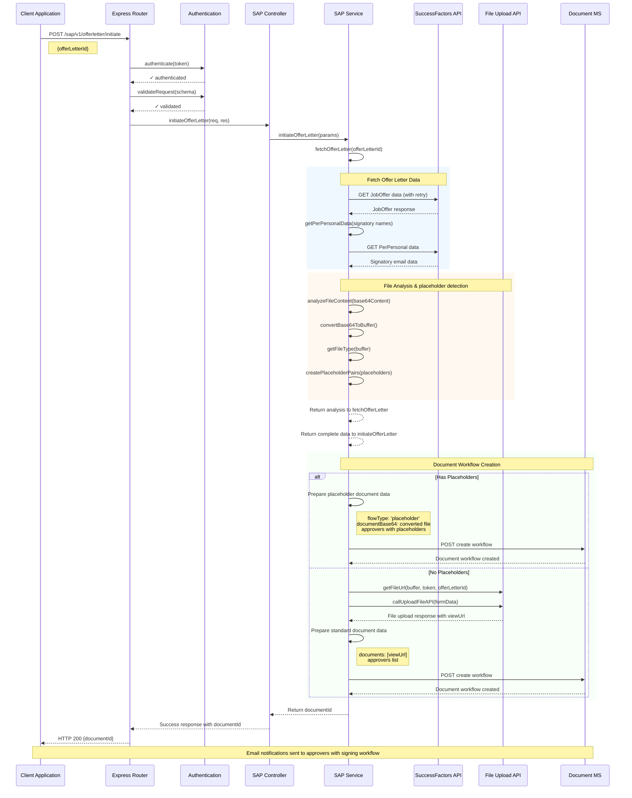
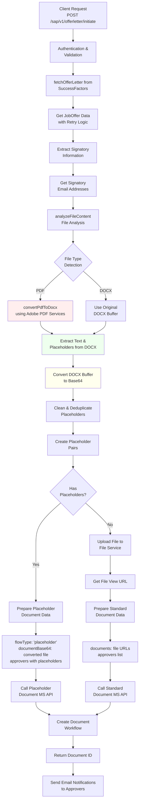
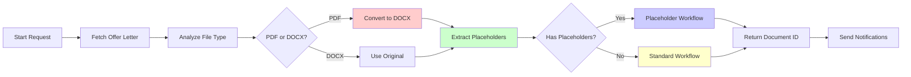

# Offer Letter Workflow - Complete Sequence Diagrams

## Overview
This document contains the complete sequence diagrams and flowcharts for the Offer Letter processing workflow in the SAP Ambassador API system.

> **Note**: To view the diagrams properly, open this file in:
> - GitHub/GitLab (automatic Mermaid rendering)
> - VS Code with Mermaid Preview extension
> - Any markdown viewer that supports Mermaid diagrams
> - Online Mermaid editor: https://mermaid.live/

## 1. Detailed Sequence Diagram



## 2. Decision Flow Diagram



## 3. Simplified Process Flow



## 4. Workflow Phases Breakdown

### Phase 1: Authentication & Data Retrieval
1. **API Call**: Client initiates with `offerLetterId`
2. **Authentication**: Token validation and request schema validation
3. **SAP Integration**: Fetch offer letter data from SuccessFactors with retry logic
4. **Signatory Data**: Retrieve signatory email addresses

### Phase 2: File Analysis & Conversion
1. **File Type Detection**: Magic byte analysis to identify PDF/DOCX
2. **PDF Conversion**: Convert PDF to DOCX using Adobe PDF Services (if needed)
3. **Text Extraction**: Extract placeholders from DOCX using Word text extractor
4. **Base64 Conversion**: Convert processed DOCX buffer to base64 for transmission
5. **Placeholder Processing**: Clean, deduplicate, and create placeholder pairs

### Phase 3: Document Workflow Creation

#### If Placeholders Exist:
- Create placeholder-based workflow with `documentBase64` containing converted DOCX
- Assign specific placeholders to each approver
- Call Placeholder Document Management Service

#### If No Placeholders:
- Upload file to File Service and get view URL
- Create standard document workflow with file URLs
- Call Standard Document Management Service

### Phase 4: Workflow Completion
1. **Document ID**: Return unique document identifier
2. **Email Notifications**: Trigger email notifications to all approvers
3. **Signing Process**: Approvers receive signing workflow based on document type

## 5. Key Features & Technical Details

### Automatic File Conversion
- **PDF to DOCX**: Uses Adobe PDF Services for high-quality conversion with structure preservation
- **Base64 Encoding**: Converted DOCX files are encoded as base64 for API transmission
- **Format Detection**: Magic byte analysis for accurate file type identification

### Smart Placeholder Management
- **Extraction**: Automatically detects signature placeholders in documents
- **Cleaning**: Removes duplicates and empty placeholders
- **Pairing**: Creates organized placeholder pairs for better workflow management

### Robust Error Handling
- **Retry Logic**: Automatic retries for SAP API calls with exponential backoff
- **Fallback Mechanisms**: Alternative processing paths for failed conversions
- **Graceful Degradation**: System continues operation even with partial failures

### Dual Workflow Support
- **Placeholder Workflows**: For documents requiring signature placeholders
- **Standard Workflows**: For documents without placeholders using file URLs
- **Dynamic Routing**: Automatically selects appropriate workflow based on content analysis

## 6. API Endpoints

### Main Endpoint
```
POST /sap/v1/offerletter/initiate
```

### Supporting Endpoints
```
GET /sap/v1/offerletter/fetch
GET /sap/v1/peremail/retrive
GET /sap/v1/perPersonal/retrive
POST /sap/v1/offerletter/convertToBase64
POST /sap/v1/offerletter/attachFile
```

## 7. Environment Variables Required

```env
SUCCESS_FACTOR_URL=<SuccessFactors API URL>
UPLOAD_FILE_URL=<File Upload Service URL>
DOCUMENT_CREATE_URL=<Standard Document Management URL>
DOCUMENT_PLACEHOLDER_CREATE_URL=<Placeholder Document Management URL>
```

## 8. How to View Diagrams

### For GitHub/GitLab:
1. Upload this file to your repository
2. View in the web interface - diagrams will render automatically
3. Use the "Raw" view to see the Mermaid source code

### For VS Code:
1. Install the "Mermaid Preview" extension
2. Open this file in VS Code
3. Use Ctrl+Shift+P → "Mermaid: Preview Current File"

### For Online Viewing:
1. Copy the Mermaid code (between ```mermaid and ```)
2. Paste into https://mermaid.live/
3. View and export as PNG/SVG

### For Documentation Sites:
- Most modern documentation platforms (GitBook, Notion, etc.) support Mermaid
- Copy the entire markdown file for full compatibility

---

*Generated on: {current_date}*

*System: SAP Ambassador API - Offer Letter Workflow* 
